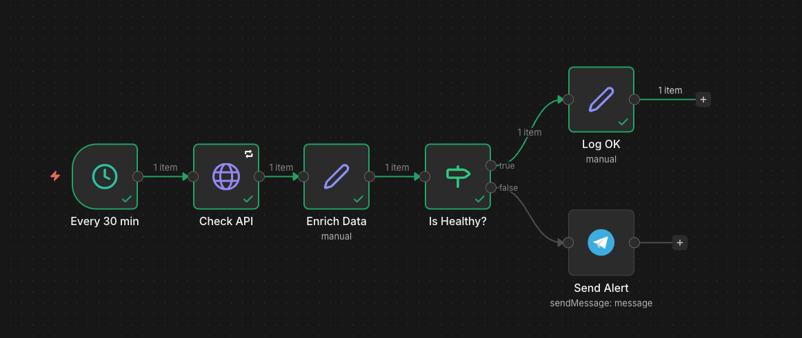

# n8n-workflows

Coleccion de workflows n8n de ejemplo, listos para importar. Cada workflow incluye documentacion, diagrama de flujo y capturas de pantalla.

## Galeria

### 1. API Health Monitor


Monitorea endpoints HTTP cada 30 minutos y envia alertas por Telegram cuando un servicio cae.

**Nodos**: Schedule Trigger, HTTP Request (con retry + full response), Set, IF, Telegram

[Ver documentacion](workflows/01-api-health-monitor.md) | [Descargar JSON](workflows/01-api-health-monitor.json)

---

### 2. Data Pipeline - CSV to Report


Recibe un CSV via Webhook, transforma y limpia los datos, filtra registros validos, genera un reporte limpio y lo devuelve como descarga.

**Nodos**: Webhook, Spreadsheet File, Code (transform), IF, Set, Respond to Webhook

[Ver documentacion](workflows/02-data-pipeline-csv.md) | [Descargar JSON](workflows/02-data-pipeline-csv.json)

---

### 3. Multi-Channel Notification Router


Recibe eventos via Webhook, valida el schema, y rutea a diferentes canales (Telegram, Email, Slack) segun el tipo de evento.

**Nodos**: Webhook, Code (validation), Switch, Telegram, Email Send, HTTP Request, Merge

[Ver documentacion](workflows/03-notification-router.md) | [Descargar JSON](workflows/03-notification-router.json)

---

## Como importar

1. Ir a n8n → Menu → Import from File
2. Seleccionar el archivo `.json` del workflow deseado
3. Configurar las credenciales indicadas en la documentacion
4. Activar el workflow

## Nodos demostrados

| Nodo | Workflows |
|------|-----------|
| Schedule Trigger | 1 |
| Webhook | 2, 3 |
| HTTP Request | 1, 2, 3 |
| IF / Conditional | 1, 2 |
| Switch / Router | 3 |
| Code (JavaScript) | 2, 3 |
| Set | 1, 2 |
| Spreadsheet File | 2 |
| Telegram | 1, 3 |
| Email Send | 3 |
| Merge | 3 |
| Respond to Webhook | 2 |

## Estructura

```
workflows/
  01-api-health-monitor.json         # Workflow importable
  01-api-health-monitor.md           # Documentacion
  01-api-health-monitor.png          # Captura de ejecucion
  01-api-health-monitor-flow.png     # Diagrama del workflow
  02-data-pipeline-csv.json
  02-data-pipeline-csv.md
  03-notification-router.json
  03-notification-router.md
```

## Licencia

MIT
