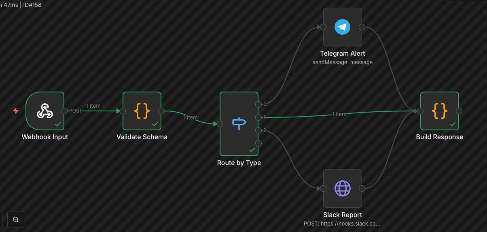

# Multi-Channel Notification Router

Recibe eventos via Webhook, valida el schema, y rutea a diferentes canales (Telegram, Email, Slack) segun el tipo de evento. Devuelve confirmacion con el estado del envio.



## Flujo

```
[Webhook POST] → [Validate Schema] → [Switch: type]
                                        ├── alert  → [Telegram Alert] ─┐
                                        ├── info   → [Send Email] ─────┤
                                        └── report → [Slack Report] ───┤
                                                                      ↓
                                        [Build Response] ← [Merge Results]
```

## Nodos utilizados

| Nodo | Tipo | Funcion |
|------|------|---------|
| Webhook Input | Webhook | Recibe POST con JSON del evento |
| Validate Schema | Code | Valida campos requeridos, tipos y prioridades permitidos |
| Route by Type | Switch | 3 salidas: alert, info, report (fallback: info) |
| Telegram Alert | Telegram | Envio de alertas urgentes |
| Send Email | Email Send | Notificaciones informativas por email |
| Slack Report | HTTP Request | Reportes a canal Slack con Block Kit formatting |
| Merge Results | Merge | Combina resultados de las ramas |
| Build Response | Code | Construye respuesta final con estado de entrega |

## Features demostradas

- **Switch/Router**: Enrutamiento dinamico basado en campo `type` con fallback
- **Input validation**: Code node con validacion de schema completa
  - Campos requeridos: `type`, `message`, `priority`
  - Validacion de valores permitidos para type y priority
  - Mensajes de error descriptivos
- **Multi-channel**: 3 canales de salida simultaneos
- **Merge**: Combinacion de resultados de multiples ramas
- **Slack Block Kit**: Formato rico en mensajes de Slack
- **Response building**: Respuesta estructurada al caller

## Formato de entrada

```json
{
  "type": "alert",
  "message": "Server CPU usage over 90%",
  "priority": "high",
  "source": "monitoring"
}
```

**Tipos validos**: `alert`, `info`, `report`
**Prioridades validas**: `low`, `medium`, `high`, `critical`

## Ejemplos de uso

```bash
# Alerta critica → Telegram
curl -X POST https://tu-n8n.com/webhook/notify \
  -H "Content-Type: application/json" \
  -d '{"type":"alert","message":"CPU over 90%","priority":"critical","source":"monitoring"}'

# Info → Email
curl -X POST https://tu-n8n.com/webhook/notify \
  -H "Content-Type: application/json" \
  -d '{"type":"info","message":"New user registered","priority":"low","source":"auth"}'

# Reporte → Slack
curl -X POST https://tu-n8n.com/webhook/notify \
  -H "Content-Type: application/json" \
  -d '{"type":"report","message":"Monthly sales report ready","priority":"medium","source":"crm"}'
```

## Respuesta

```json
{
  "success": true,
  "event_id": "a1b2c3d4",
  "type": "alert",
  "channel": "telegram",
  "delivered_at": "2026-04-16T12:00:00.000Z",
  "processed": 1
}
```

## Variables de entorno necesarias

| Variable | Descripcion |
|----------|-------------|
| `TELEGRAM_CHAT_ID` | Chat ID de Telegram |
| `SMTP_FROM` | Email remitente |
| `NOTIFICATION_EMAIL` | Email destino |
| `SLACK_WEBHOOK_URL` | Webhook de Slack |

## Credenciales necesarias

- **Telegram Bot API**: Token del bot
- **SMTP**: Cuenta de email para envio
